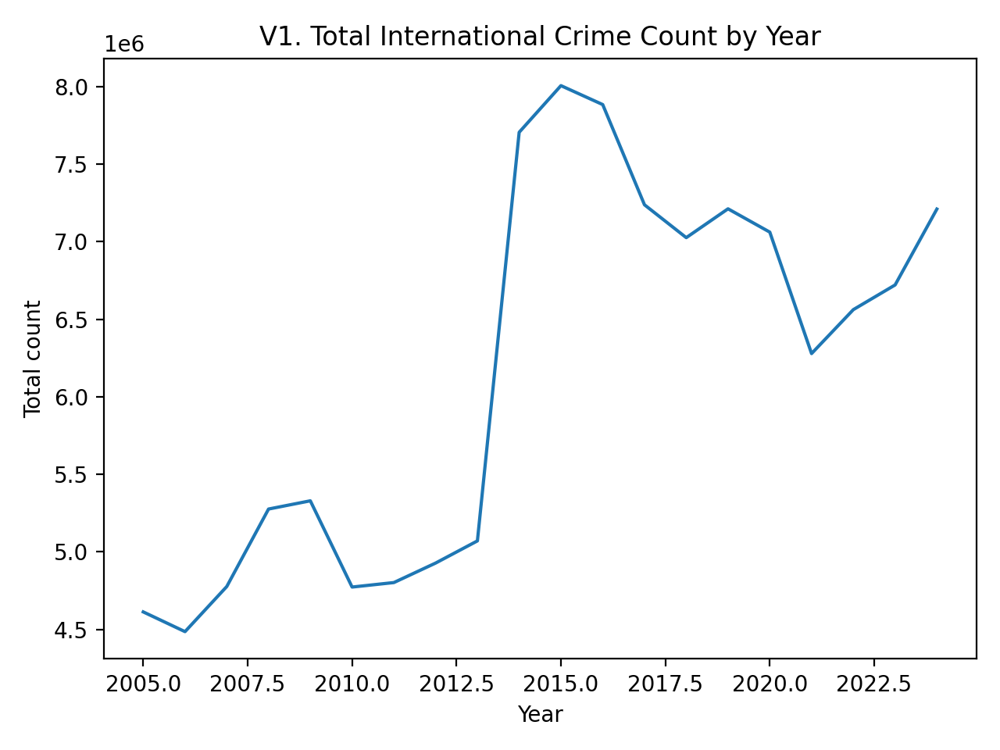
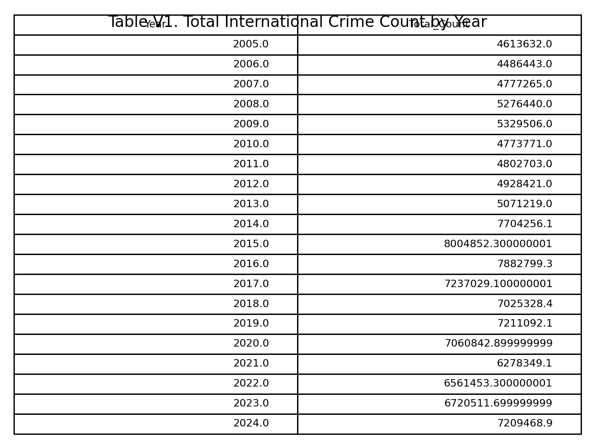
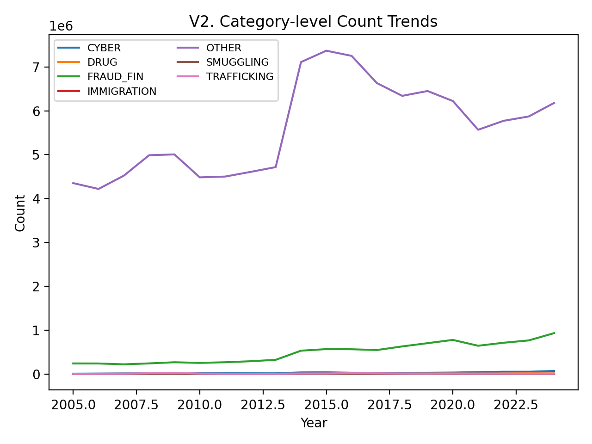
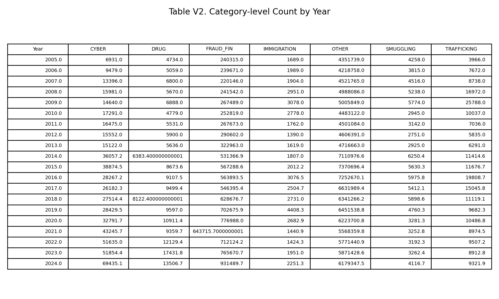
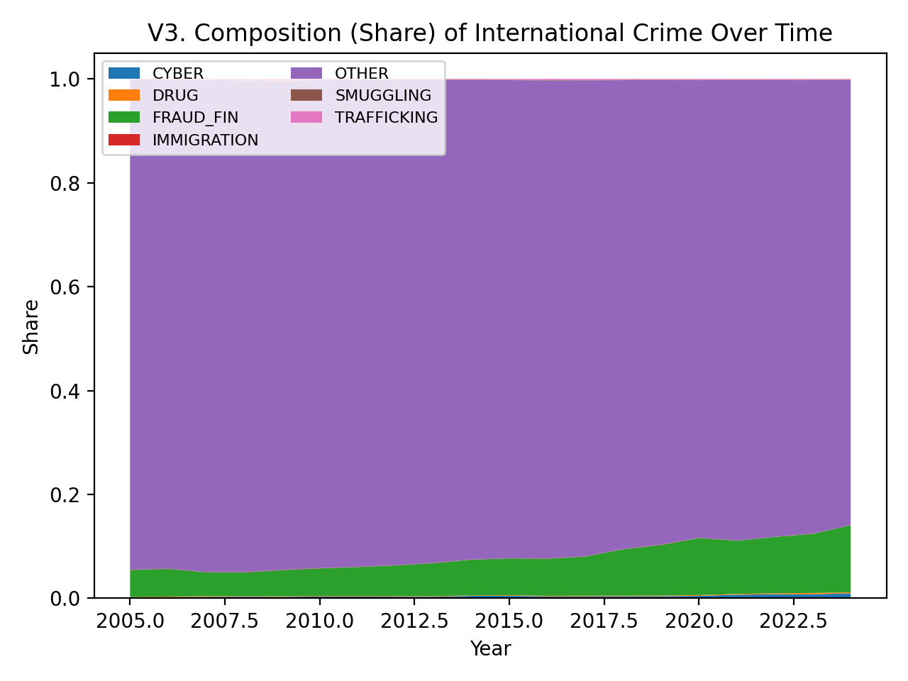
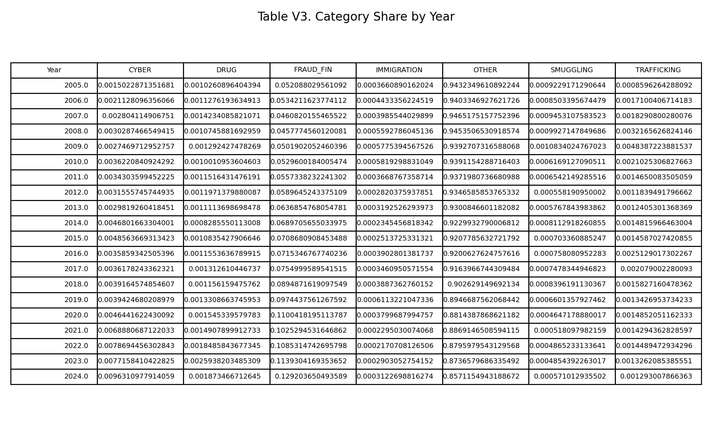
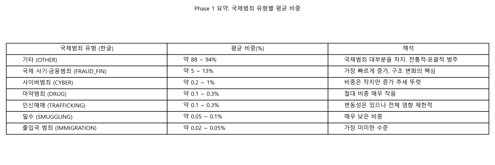

# 3. Phase 1 — 국제범죄 규모 및 구성의 장기 추세 분석

(Baseline Trend & Composition Analysis)

## 3.1 목적 (Objective)

Phase 1의 목적은 다음 세 가지이다.

### 1. 국제범죄 전체 규모의 장기적 변화를 파악한다.

### 2. 범죄 유형별 절대 건수 추이를 비교한다.

### 3. 전체 범죄 내에서 유형별 구성비(share)의 구조적 변화를 확인한다.

이는 이후 Phase 2에서 수행하는 **구조 변화 분석(PCA, Regime Analysis)**의 기준선(baseline)을 제공한다.

## 3.2 결과 ① 전체 국제범죄 건수 추이
  
### 시각화

그래프:   

표:   

### 축 설명

X축 (Year): 연도 (2005–2024)

Y축 (Total Count): 해당 연도의 국제범죄 총 발생 건수

### 해석

2005~2013년: 완만한 증가 및 정체 구간

2014년 이후 급격한 수준 변화(Level Shift) 발생

2015년 정점 이후 감소 → 2021년 팬데믹 시기 급락

이후 재상승 국면 진입

👉 총량 관점에서 이미 구조적 단절 가능성 존재

## 3.3 결과 ② 범죄 유형별 절대 건수 추이

### 시각화

그래프: 

표: 

축 설명

X축: 연도

Y축: 범죄 유형별 연간 건수

해석

OTHER: 절대적 비중 유지, 전체 변동의 대부분 설명

FRAUD_FIN: 장기적으로 가장 뚜렷한 증가 추세

CYBER: 규모는 작으나 지속적 상승

기타 유형(DRUG, TRAFFICKING 등): 변동성은 있으나 전체 구조 영향은 제한적

## 3.4 결과 ③ 범죄 구성비(Share)의 변화
    
### 시각화

그래프: 

표: 

### 축 설명

X축: 연도

Y축: 전체 범죄 대비 유형별 비중 (합 = 1)

### 해석

OTHER 비중은 점진적으로 감소

FRAUD_FIN, CYBER의 상대적 중요성 증가

“총량 변화”보다 구성의 변화가 더 구조적 신호

3.5 Phase 1 핵심 요약

국제범죄는 단순 증가/감소가 아닌 구조 변화를 동반

2014년 전후로 체계적 단절 가능성

범죄 유형의 구성비 변화가 핵심 신호

→ Phase 2에서 구조적 거리, Regime, PCA 분석 필요성 확보
