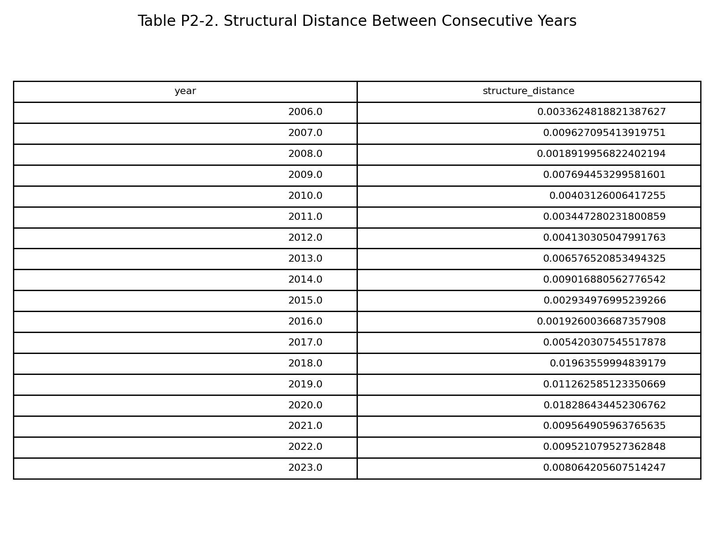
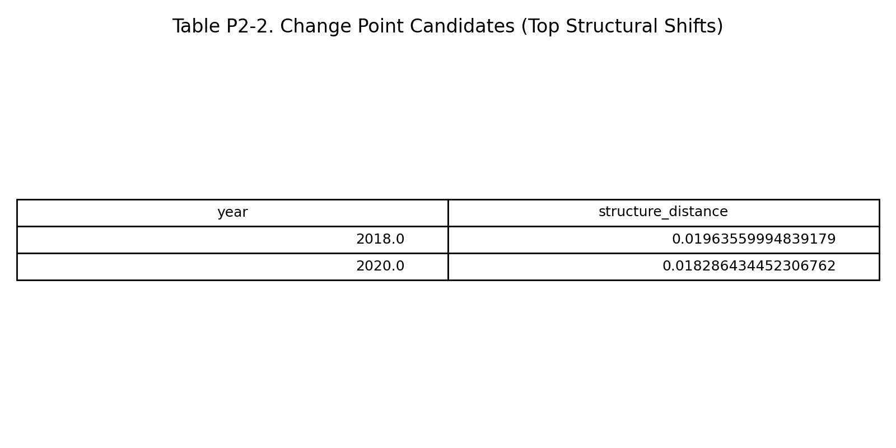
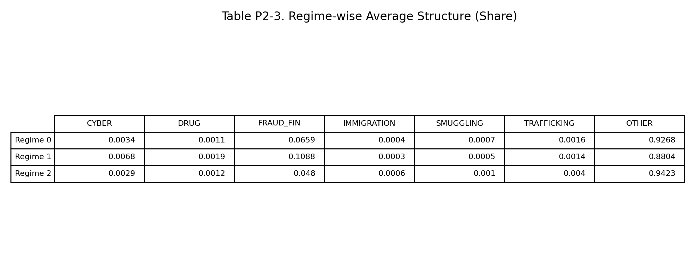
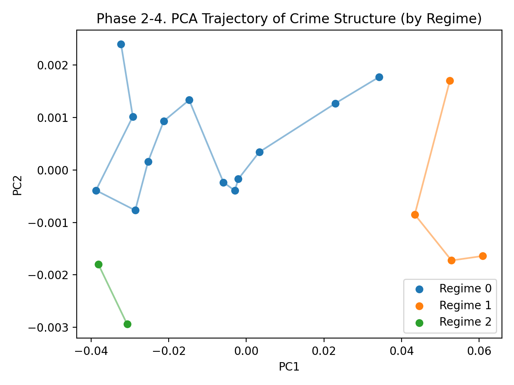
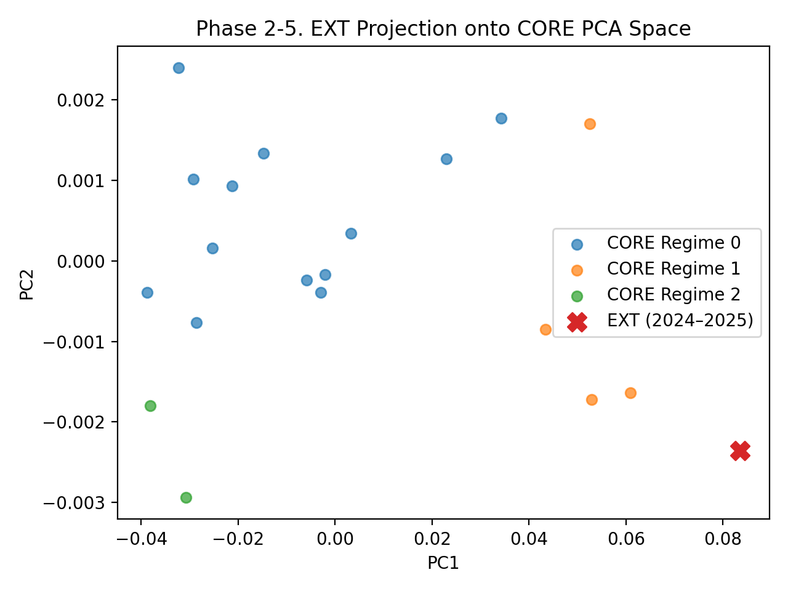

# 4. Phase 2 — 국제범죄 구조 변화 및 Regime 분석

(Structural Change, Regime Shift & PCA Analysis)

## 4.1 목적 (Objective)

Phase 2는 Phase 1에서 확인된 변화가
우연적 변동인지, 구조적 전환(structural shift)인지를 판별하는 것이 목적이다.

이를 위해 다음 분석을 수행한다.

연도 간 범죄 구조 거리(Structural Distance) 계산

Change Point 후보 연도 식별

범죄 구조의 Regime 분할

PCA를 통한 구조 공간 시각화

## 4.2 결과 ① 연도 간 구조 거리 (Structural Distance)
  
### 표

  
### 개념 설명 (직관적)

- 각 연도는 “범죄 구성비 벡터”

- 두 연도 간 거리 =
    → “범죄 구조가 얼마나 달라졌는가”

값이 클수록:

- 범죄 유형 조합이 크게 바뀜

- 정책·환경 변화 가능성 ↑

### 관찰

- 2018년, 2020년에서 거리 급증

- 일반적 연도 대비 2~3배 수준

## 4.3 결과 ② 구조적 변화 지점(Change Point)
  
### 표

### 해석

- 2018년: 디지털·금융범죄 비중 급증 시점

- 2020년: 팬데믹 → 범죄 기회 구조 변화

👉 단순한 수치 변동이 아닌 구조적 전환점

## 4.4 결과 ③ Regime별 평균 범죄 구조
  
### 표

### 직관적 설명

Regime = 유사한 범죄 구조를 가진 연도 묶음

Regime	특징 요약
- Regime 0	전통적 구조, OTHER 중심
- Regime 1	FRAUD_FIN·CYBER 비중 최대
- Regime 2	특수·과도기적 구조

👉 Regime 1은 질적으로 다른 범죄 환경

## 4.5 결과 ④ PCA 기반 구조 공간 분석
  
### 시각화

### PCA 축 해석 (중요)

- PC1 (X축)
    → 전통 범죄 ↔ 신흥 금융·사이버 범죄 축
    값이 클수록 FRAUD_FIN, CYBER 중심

- PC2 (Y축)
    → 비주류·불안정 범죄 조합 축
    Regime 내부 변동성 반영

### 해석

- Regime 0 → Regime 1: 구조적 이동(trajectory)

- EXT(2024–2025) 투영 결과:

    Regime 1보다 더 오른쪽

    ### 신흥 범죄 집중 심화 상태

## 4.6 Phase 2 핵심 요약

국제범죄 구조는 연속적 변화가 아닌 Regime 전환

2018·2020년은 구조적 분기점

PCA 결과는 미래 구조가 과거와 다른 공간에 있음을 시사

👉 정보·치안·안보 관점에서
“과거 기준 대응은 더 이상 유효하지 않음”
